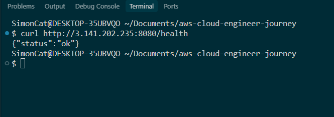
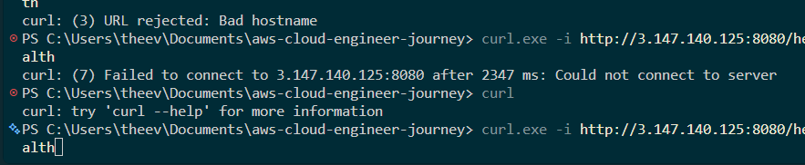
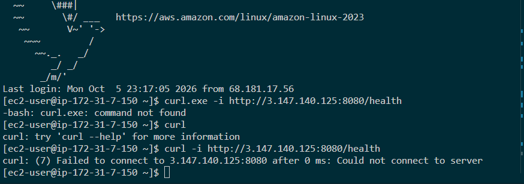

Runbook
Overall this lab wasn't too complicated. What I first did was created an instance inside of of the default VPC using most default settings. This included the default and free settings such as the AMI and instance type. 

Additionally, I created a key pair so I could SSH into it later on. Without this keypair, I wouldn't have the auhtorization to interact with the remote IP. Then, I copied over some user data (script) that would load on start of the instance. This script would download the dependices aswell as run our app.py. Additionally, we loaded up a text snippet of some sample data so our app could run on AWS servers. Lastly, since creating a instance creates a volume, we went into that volume and created a snapshot of it. Then, we terminated the instance. 

The "PVEOF and CSVEOF" and end markers. It basically pipes all of the lines of code through the "<<" until it reaches a line without autations like CSVEOF or PVEOF. Note to mention, you can use any marker, even like "BANANA". 

I had trouble curling the remote IP of my server. This was until I realized I actually didn't put any code in the startup script of the actual app.py... 

